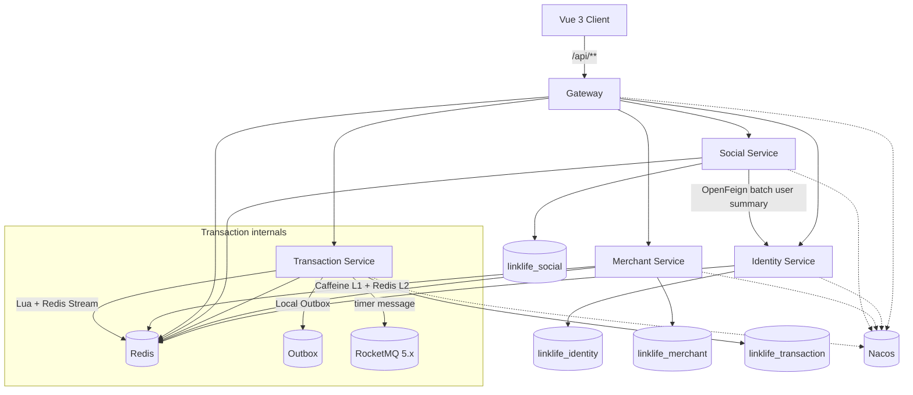

# LinkLife

> 面向高并发交易、缓存一致性、微服务治理与故障恢复验证的本地生活微服务平台。

**Java 17 · Spring Boot 3.5 · Spring Cloud · Spring Cloud Alibaba · Gateway · Nacos · OpenFeign · Sentinel · RocketMQ 5.x · Redis · Redis Stream · Caffeine · MySQL · MyBatis-Plus · Docker · JMeter · Vue 3 · TypeScript · Vite**

LinkLife 覆盖用户会话、商铺发现、GEO 附近商铺、优惠券秒杀、异步订单、动态内容、关注与点赞等本地生活场景。项目重点不是堆叠业务页面，而是围绕 **高并发交易链路、缓存一致性、微服务治理、数据边界和可靠性验证** 构建一套可运行、可回归、可压测、可故障演练的完整工程体系。

---

## 1. 项目简介

LinkLife 从本地生活业务场景出发，把工程重心放在**秒杀准入与异步落库的一致性、订单生命周期可靠性、异构系统间的可靠消息投递、缓存一致性、微服务边界与故障恢复**上，并全部用可复现的源码、自动化测试、压测与故障演练证据闭环验证。所有结论均来自本仓库可直接运行的工程，不宣称生产容量、SLA 或在线规模。

## 2. 核心亮点

| 方向 | 实现 |
|---|---|
| 高并发秒杀 | Redis Lua 原子准入 → Redis Stream → Consumer Group / PEL → MySQL 事务 |
| 可靠订单链路 | Submission 状态机、Pending 恢复、有界重试、DLQ、失败补偿 |
| 可靠消息投递 | Local Outbox + RocketMQ 5.x 定时消息，DB 与 MQ 之间无双写丢失窗口 |
| 超时关单 | 订单级 `payment_due_at` 冻结事实 + RocketMQ 主动触发 + Scheduler 修复兜底 |
| 幂等关闭 | 统一 `UNPAID → CANCELED` MySQL CAS，重复消息/竞争只有一个业务副作用 |
| 缓存一致性 | Caffeine L1 + Redis L2 + negative cache + afterCommit 失效 + epoch fence |
| 服务治理 | Gateway Sentinel 热点限流、Social → Identity 熔断与分级降级 |
| 数据边界 | 4 个业务数据库、Redis ACL namespace、Gateway 可信身份头 |
| 工程验证 | 1006 自动化测试、双机正式压测（50/100/200/500 并发热点查询、1000 用户突发秒杀 3 轮 0 超卖 0 重复订单）、真实故障演练 |
| 展示前端 | Vue 3 + TypeScript + Vite，中文本地生活 Demo，真实 API 联调 |

## 真实运行演示

以下截图全部来自真实 Vue 页面，请求经 Vite → Gateway → Merchant / Transaction 完整链路，非静态 Mock。

### 真实产品页面


真实 Vue 商户详情页：通过 Gateway 调用 Merchant（商户信息）与 Transaction（优惠券列表），展示拾光咖啡的地址、营业时间、评分、销量、人均，以及秒杀券的实时剩余库存与“立即抢购”入口。

### 秒杀异步落库


点击“立即抢购”后，请求经 Vite → Gateway → Transaction，由 Redis Lua 原子准入，Redis Stream Consumer Group 异步落库；页面轮询到 PERSISTED 后才展示“订单已落库”。

### 未支付订单可靠关闭


同一订单从 UNPAID → CANCELED：Local Outbox + RocketMQ 定时消息主动触发，Scheduler 扫描兜底；`UNPAID → CANCELED` MySQL CAS 保证库存补偿只执行一次。

### Benchmark 摘要

上表仅摘录正式双机测试结论，完整环境、JTL/CSV、复算方法及故障演练见性能与可靠性文档。

| 场景 | 正式口径 | 结果 |
|---|---|---|
| 热点查询 | 双机，500 concurrency | QPS ≈ 17.4K，P95 = 36 ms |
| 两级缓存 | Redis GET/request | OFF ≈ 0.879，ON ≈ 0.00013，下降约 99.98% |
| 秒杀 | 1000 unique-user burst，连续 3 轮 | 0 oversell，0 duplicate orders，P95 ≈ 40 ms |

正式证据：[docs/performance.md](docs/performance.md) · [docs/reliability.md](docs/reliability.md)

## 3. 系统架构



运行时包含 **4 个业务服务 + 1 个 Gateway**，服务发现使用 Nacos，外部请求统一经 Gateway 进入。Transaction 内部额外使用 Redis Stream、Local Outbox 与 RocketMQ：

- **Redis Stream**：秒杀准入后的异步订单持久化通道；
- **Local Outbox**：MySQL 事务内可靠记录发布/补偿意图；
- **RocketMQ**：只属于 Transaction 的未支付订单超时触发通道，**不是跨服务 Event Bus**。

详细边界见 [docs/architecture.md](docs/architecture.md)。

## 4. 秒杀交易链路

秒杀请求不会直接同步落库，而是先在 Redis 中完成原子准入：

```text
Client
  ↓
Gateway
  ↓
Redis Lua
  ├─ 库存校验与扣减
  ├─ 一人一单校验
  └─ Stream 入队
  ↓
Consumer Group / PEL
  ↓
MySQL Transaction（库存 -1 + INSERT UNPAID 订单，冻结 payment_due_at）
  ↓
ACK
```

准入成功只代表订单进入异步处理链路。前端通过 Submission 状态查询区分：

```text
ACCEPTED → PROCESSING → PERSISTED
```

只有 `PERSISTED` 才表示订单已经完成数据库持久化。异常路径配套 Pending 恢复、有界重试、失败分类、DLQ 与幂等补偿。

## 5. 未支付订单超时关闭

`payment_due_at` 是订单创建事务内冻结的**订单级绝对到期事实**。RocketMQ 主动触发与 Scheduler 修复兜底共享同一事实与同一关闭内核：

```text
                 payment_due_at
                       |
          +------------+------------+
          |                         |
          v                         v
Local Outbox -> RocketMQ       Scheduler
          |                         |
          +------------+------------+
                       |
                       v
          OrderCloseTransactionService
                       |
                       v
             UNPAID -> CANCELED CAS
                       |
             +---------+---------+
             |                   |
         MySQL stock          status log
                                 |
                         ORDER_CLOSED Outbox
                                 |
                         Redis idempotent
                           compensation
```

- **payment_due_at**：订单创建本地事务内冻结，运行期修改 `payment-timeout` 不会重算历史订单；
- **MQ**：未支付订单的主动 timeout trigger；
- **Scheduler**：基于同一 `payment_due_at` 的 repair / sweep fallback；
- **关闭内核**：MQ 与 Scheduler 共用 `OrderCloseTransactionService`，一次 `UNPAID → CANCELED` MySQL CAS 决定唯一业务副作用。

## 6. Local Outbox 与幂等

订单创建与 timeout 发布意图在同一个 MySQL 本地事务内提交，从根本上消除 **DB 提交与 MQ 发送之间的双写丢失窗口**；Broker 不可达时发布保持 PENDING 并重试，不假成功。

RocketMQ 投递语义是 **at-least-once，不是 exactly-once**：

- 重复的 timeout 消息最终由 `UNPAID → CANCELED` MySQL CAS 吸收，只产生一次库存返还、一条状态日志、一条 `ORDER_CLOSED` Outbox；
- 关闭成功后的 Redis 库存补偿由 `ORDER_CLOSED` Outbox 驱动，幂等 marker 保证重复事件不重复 +1；
- 同一订单的 MQ 触发与 Scheduler 扫描并发竞争时，同样只有一个 CAS 胜者。

## 7. 缓存一致性

Merchant 的高频读接口采用：

```text
Caffeine L1
   ↓
Redis L2
   ↓
MySQL
```

写操作在数据库事务提交后执行缓存失效，并通过 **epoch fence** 阻止写期间已经在途的旧查询重新回填 L1。缓存语义定位为 **bounded staleness**，不宣称强一致。

## 8. 微服务与治理

- Gateway 单一外部入口，Reactive Redis 会话认证，清洗客户端伪造的 `X-LinkLife-*` 头；
- Nacos 服务注册与发现，OpenFeign 内部调用；
- Gateway Sentinel 对热点接口精确 QPS 限流，超限返回明确 429；
- Social → Identity 是当前**唯一**跨业务同步 RPC：展示型调用降级不伪造用户，正确性型调用 fail-closed；
- database-per-service：4 个独立业务数据库 + 最小权限账号；
- Redis DB0 + per-service ACL namespace，跨 namespace 访问返回 NOPERM。

## 9. 测试与工程验证

LinkLife 从 **自动化回归、热点查询压测、秒杀并发验证、故障演练** 四个层次验证核心链路。自动化回归在本地 Docker 环境运行；热点查询与秒杀最终 Benchmark 使用双机正式压测（压测端与服务端分离），均为工程观测值，不代表生产 SLA 或线上容量。

最终冻结版本：

```text
Tests     1006
Failures  0
Errors    0
Skipped   5
```

覆盖微服务边界、缓存、交易可靠性、权限守卫、Schema contract、RPC 降级、Outbox 与超时链路关键异常路径。

## 10. 双机热点查询 Benchmark

最终正式 Benchmark 使用双机拓扑：服务端 A（AMD Ryzen 9 7945HX）运行 LinkLife 服务端及 Docker 依赖；压测端 B（AMD Ryzen 5 5600G）独立运行 JMeter 5.6.3 / Java 17。两机 1 Gbps 有线直连，正式测试期间链路无丢包。

热点查询档位：50 / 100 / 200 / 500 并发，每个档位 3 次正式 run。

| 并发 | Caffeine | Median QPS | P95 | P99 | Redis GET / request |
|---|---:|---:|---:|---:|---:|
| 50 | OFF | ≈ 12.1K | 6 ms | 8 ms | ≈ 0.935 |
| 50 | ON | ≈ 14.3K | 5 ms | 7 ms | ≈ 0.00028 |
| 100 | OFF | ≈ 14.4K | 11 ms | 15 ms | ≈ 0.920 |
| 100 | ON | ≈ 17.0K | 9 ms | 13 ms | ≈ 0.00019 |
| 200 | OFF | ≈ 15.6K | 21 ms | 30 ms | ≈ 0.913 |
| 200 | ON | ≈ 17.2K | 17 ms | 24 ms | ≈ 0.00017 |
| 500 | OFF | ≈ 15.6K | 40 ms | 52 ms | ≈ 0.879 |
| 500 | ON | ≈ 17.4K | 36 ms | 45 ms | ≈ 0.00013 |

当前正式 headline：

**双机 500 并发热点查询：QPS ≈ 17.4K，P95 36 ms；Caffeine ON 时 Redis GET/request ≈ 0.00013，相较 OFF（≈ 0.879）降低约 99.98%。**

这些是本地双机工程观测值，**不外推生产容量或 SLA**。

## 11. 双机秒杀并发验证

秒杀档位：300 / 500 / 800 / 1000 unique-user burst，每档 3 次正式 run，全部 12 次运行均完成服务端一致性核对。每个档位最终均满足：Redis ordered users = 对应用户数、MySQL orders = 对应用户数、distinct users = 对应用户数、duplicate orders = 0、oversell = 0、Redis stock = 0、PEL = 0、DLQ = 0。

最高正式验证档位：**1000 unique-user burst，连续 3 轮正确性验证通过**。

| Metric | Result |
|---|---:|
| Persisted orders | 1000 |
| Distinct users | 1000 |
| Duplicate orders | 0 |
| Oversell | 0 |
| HTTP errors | 0 |
| P95 | ≈ 40 ms |
| P99 | ≈ 44 ms |
| PEL | 0 |
| DLQ | 0 |

当前正式 headline：

**双机压测下 1000 用户突发秒杀连续 3 轮 0 超卖、0 重复订单，P95 ≈ 40 ms。**

注意：这是 1000 unique-user burst 的工程验证结果，不表述为“最大支持 1000 并发”或系统容量。

## 12. RocketMQ 真实验证

版本：

```text
RocketMQ Java Client: 5.2.1
RocketMQ Broker:      5.5.0（NameServer + Broker + gRPC Proxy，本地单节点集成验证拓扑）
```

真实主链 **4/4 PASS**：

1. Local Outbox → Producer → 绝对定时消息到点 → PushConsumer → 统一关闭内核 → `ORDER_CLOSED` → Redis 幂等补偿；
2. PAID 订单不关闭；
3. 3 条物理重复消息只产生 1 次业务关闭副作用；
4. MQ 与 Scheduler 同时竞争，只有 1 个 CAS 胜者。

冷启动：Broker 在应用启动前已 down 时，Transaction Context 与 Scheduler 仍可用，Scheduler 可关闭到期订单并回补 MySQL 库存；Broker 恢复后，同一进程的 Producer/Consumer 自动就绪。

故障演练：

- Broker 发布中断：Outbox 保持 PENDING、重试计数增加、不假成功，恢复后自动发送并关单；
- Consumer 在到期时刻停机：订单保持 UNPAID，恢复后的消费者处理持久化消息并收敛；
- NameServer + Broker 重启：已入 Broker 的定时消息从持久化 store 恢复并消费。

本地观测（single-node local development observation，非生产 SLA/HA/吞吐保证）：

```text
consumeAt - dueAt            ≈ 199.378 ms
Broker 恢复 → Producer ready ≈ 16.34 s
Broker 恢复 → Consumer ready ≈ 16.42 s
```

## 13. 故障演练

按故障类型整合全部真实演练：

| 故障 | 验证结果 |
|---|---|
| Gateway 热点过载 | 热点精确 429，无订单副作用，非热点不受影响：PASS |
| Identity 服务中断 | 展示型 RPC 降级（不伪造用户）、正确性型 fail-closed、恢复自动复原：PASS |
| Redis 重启 | AOF + volume 恢复 session/stream/PEL，ACL 隔离保持：PASS |
| 秒杀期间 MySQL 故障 | 已准入订单保持 Pending、不误 ACK、不补偿，恢复后同一 orderId 落库：PASS |
| RocketMQ Broker 发布中断 | Outbox 重试收敛、不假成功：PASS |
| RocketMQ Consumer 停机 | 到期订单保持 UNPAID，恢复后收敛：PASS |
| RocketMQ Broker/NameServer 重启 | 定时消息从持久化 store 恢复消费：PASS |
| Broker 冷启动不可用 | Context/Scheduler 可用，Broker 恢复后同进程客户端自动就绪：PASS |

完整证据见 [docs/reliability.md](docs/reliability.md)。

## 14. 前端

公开版本包含 Vue 3 + TypeScript + Vite 前端：

- 发现页；商铺分类、搜索与 GEO 附近商铺；
- 商铺详情与优惠券；秒杀异步状态展示；
- 动态内容；我的订单；工程验证页。

Demo 商铺与动态使用本地 WebP 视觉素材；用户上传图片优先使用后端 `/api/files/**`，未知数据回退到本地 deterministic visual。

## 15. Quick Start

### 环境

- Docker Desktop
- JDK 17
- Maven
- Node.js / npm

### Backend

```bat
cd backend
mvn -DskipTests package
cd ..
copy backend\deploy\stage4.env.example .env
```

将 `.env` 中 REQUIRED 占位符替换为本地开发值后：

```bat
docker compose --env-file .env -f backend\deploy\docker-compose.stage4.yml up -d
```

Gateway：`http://127.0.0.1:8080`；健康检查：`GET /actuator/health`、`GET /api/shop/1`、`GET /api/shop-type/list`、`GET /api/blog/hot?current=1`。

> RocketMQ 未支付超时功能**默认安全关闭**（`LINKLIFE_ORDER_TIMEOUT_MQ_ENABLED=false`）。默认启动命令不需要任何 RocketMQ 配置；启用时需配置 endpoint/topic/tag/consumer-group，并满足 Outbox/Scheduler 配置守卫。`LINKLIFE_ORDER_PAYMENT_TIMEOUT` 必须是 `[1s, 24h]` 的整秒 Duration。

### Frontend

```bash
cd frontend
npm ci
npm run dev
```

默认开发地址：`http://127.0.0.1:5173`。

完整运行与故障复现见 [docs/runbook.md](docs/runbook.md)。

## 16. Repository Layout

```text
backend/
  linklife-common-core/          跨服务契约
  linklife-common-web/           MVC 共用件
  linklife-gateway/              唯一外部入口
  linklife-identity-service/     用户/会话
  linklife-merchant-service/     商铺/缓存/GEO
  linklife-transaction-service/  秒杀/订单/Outbox/RocketMQ 超时
  linklife-social-service/       动态/关注/点赞
  deploy/                        本地 Compose、env example、迁移脚本
  deploy/rocketmq-timeout-it/    本地单节点 RocketMQ 集成验证拓扑

frontend/
  Vue 3 + TypeScript + Vite 展示前端

performance-test/
  JMeter benchmark、JTL 分析、故障演练脚本

docs/
  architecture / performance / reliability / runbook
```

## 17. Documentation

- [Architecture](docs/architecture.md)
- [Performance](docs/performance.md)
- [Reliability](docs/reliability.md)
- [Runbook](docs/runbook.md)

## 18. 工程边界

当前版本**包含**：

- RocketMQ 5.x 单节点开发/集成验证拓扑（仅 Transaction 未支付超时链路，非跨服务 Event Bus）。

当前版本**没有**：

- Kafka
- Seata
- Kubernetes
- Prometheus / Grafana / SkyWalking
- Nacos 集群
- MySQL 主从复制
- Redis Cluster
- RocketMQ 生产集群 HA

这些不是为了丰富技术栈而虚构的能力。LinkLife 当前重点是把已经实现的交易、缓存、治理和可靠性链路做完整，并通过可复现测试、压测和故障演练验证其行为。最终性能数字来自双机正式压测，恢复数字来自本地 Docker 演练，均仅用于工程验证，不代表生产 SLA 或线上容量。
