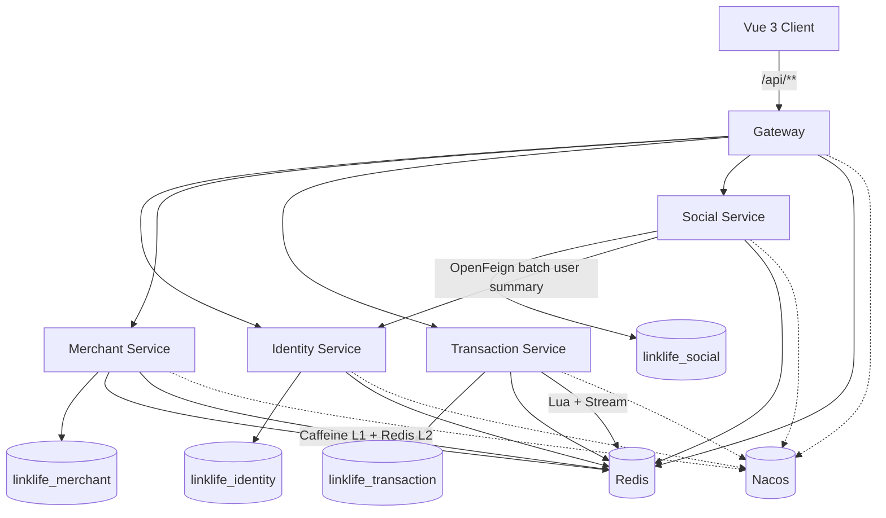

# LinkLife

> 面向高并发交易、缓存一致性、服务治理与故障恢复验证的本地生活微服务平台。

**Java 17 · Spring Boot 3.5 · Spring Cloud · Spring Cloud Alibaba · Gateway · Nacos · OpenFeign · Sentinel · Redis · Caffeine · MySQL · MyBatis-Plus · Docker · JMeter · Vue 3 · TypeScript · Vite**

LinkLife 覆盖用户会话、商铺发现、GEO 附近商铺、优惠券秒杀、异步订单、动态内容、关注与点赞等本地生活场景。项目重点不是堆叠业务页面，而是围绕 **高并发交易链路、缓存一致性、微服务治理、数据边界和可靠性验证** 构建一套可运行、可回归、可压测、可故障演练的完整工程体系。

---

## 核心亮点

| 方向 | 实现 |
|---|---|
| 高并发秒杀 | Redis Lua 原子准入 → Redis Stream → Consumer Group / PEL → MySQL 事务 |
| 交易可靠性 | Submission 状态机、Pending 恢复、重试、DLQ、补偿、Outbox、超时关单 |
| 缓存一致性 | Caffeine L1 + Redis L2 + negative cache + afterCommit 失效 + epoch fence |
| 服务治理 | Gateway Sentinel 热点限流、Social → Identity 熔断与分级降级 |
| 数据边界 | 4 个业务数据库、Redis ACL namespace、Gateway 可信身份头 |
| 工程验证 | 969 自动化测试、42 组本地 Benchmark、秒杀并发验证、真实故障演练 |
| 展示前端 | Vue 3 + TypeScript + Vite，中文本地生活 Demo，真实 API 联调 |

---

## 系统架构



运行时包含 **4 个业务服务 + 1 个 Gateway**。4 个业务服务分别拥有独立 MySQL 数据库，服务发现使用 Nacos，所有外部业务请求统一经 Gateway 进入。

详细边界见 [docs/architecture.md](docs/architecture.md)。

---

## 高并发秒杀链路

秒杀请求不会直接同步落库，而是先在 Redis 中完成原子准入：

```text
Client
  ↓
Gateway
  ↓
Redis Lua
  ├─ 库存校验与扣减
  ├─ 一人一单校验
  └─ Stream 入队
  ↓
Consumer Group / PEL
  ↓
MySQL Transaction
  ↓
ACK
```

准入成功只代表订单进入异步处理链路。前端通过 Submission 状态查询区分：

```text
ACCEPTED → PROCESSING → PERSISTED
```

只有 `PERSISTED` 才表示订单已经完成数据库持久化。

异常路径配套：

- Pending List 定时恢复；
- 有界重试与失败分类；
- DLQ；
- 幂等补偿 Lua；
- 本地 Outbox；
- 订单超时关闭。

---

## 缓存一致性

Merchant 的高频读接口采用：

```text
Caffeine L1
   ↓
Redis L2
   ↓
MySQL
```

写操作在数据库事务提交后执行缓存失效，并通过 **epoch fence** 阻止写期间已经在途的旧查询重新回填 L1。

缓存语义定位为 **bounded staleness**，不宣称强一致。

---

# 测试与工程验证

LinkLife 不只验证“接口能不能跑”，而是从 **自动化回归、热点查询压测、秒杀并发验证、故障演练** 四个层次对核心链路进行验证。

以下均为本地 Docker / JMeter 环境下的工程观测值，不代表生产 SLA 或线上容量。

## 1. 自动化测试

最终冻结版本：

```text
Tests     969
Failures  0
Errors    0
Skipped   5
```

测试覆盖微服务边界、缓存、交易可靠性、权限守卫、Schema contract、RPC 降级及关键异常路径。

---

## 2. 热点查询与缓存压测

对 Shop 热点查询进行固定本地 JMeter 场景验证。

50 并发线程下的正式观测：

| 场景 | Median QPS | P95 | Redis GET / request |
|---|---:|---:|---:|
| Caffeine L1 关闭 | 2152.543 | 29 ms | ≈ 1 |
| Caffeine L1 开启 | 3089.865 | 25 ms | ≈ 0.001 |

这里更关注的是缓存层级变化对 **Redis 访问量和热点读路径** 的影响。

其中 `Redis GET / request ≈ 1 → ≈ 0.001` 为本地 measured-window 观测值，不用于推导生产容量结论，也不将本地 QPS 差异直接包装为固定性能提升比例。

---

## 3. 秒杀并发验证

正式 300 unique-user burst 场景：

| Metric | Result |
|---|---:|
| Accepted | 300 |
| Persisted orders | 300 |
| Distinct users | 300 |
| Duplicate orders | 0 |
| Median P95 | 252 ms |

3 次正式 run 的 P95：

```text
307 ms
252 ms
109 ms
```

3/3 run 中均未观察到：

```text
oversell
duplicate order
```

100-user 档也全部完成准入与持久化。

500-user 档存在客户端侧连接失败，因此仓库**不把该档位描述为“全部请求成功”或系统容量上限**。

完整测试结果见 [docs/performance.md](docs/performance.md)。

---

## 4. 故障演练

Stage 6B 对真实运行环境进行了 4 类故障验证。

### Gateway 热点限流

预期：

```text
热点请求超过阈值
→ 返回明确 429
→ 不产生错误订单副作用
```

结果：

```text
PASS
```

### Identity 服务故障

验证：

- 展示型调用可以降级；
- 正确性型 RPC fail-closed；
- 不伪造用户数据；
- 服务恢复后调用自动恢复。

结果：

```text
PASS
```

### Redis 重启

验证：

- session；
- Stream；
- Pending / PEL；

在任务环境重启后能够恢复并继续处理。

结果：

```text
PASS
```

### 秒杀期间 MySQL 故障

真实验证链路：

```text
Redis 已完成准入
↓
MySQL 暂时不可用
↓
消息保持 Pending
↓
不提前 ACK
↓
不错误补偿
↓
MySQL 恢复
↓
同一 orderId 最终落库
↓
对应 Pending 条目消失
```

一次本地演练记录到恢复收敛观测值：

```text
8.45 s
```

该数据只描述本地故障实验，不构成生产恢复 SLA。

完整过程见 [docs/reliability.md](docs/reliability.md)。

---

## 服务治理与安全边界

### Sentinel

Gateway 对热点接口实施精确限流，包括：

- `/api/blog/hot`
- `/api/shop/of/type`
- `/api/voucher-order/seckill/**`

超限返回明确 `429` JSON，非热点接口不被同一规则误伤。

### RPC 降级

Social → Identity 是当前唯一跨业务服务同步 RPC。

- 展示型调用允许降级，但不伪造用户数据；
- 正确性型调用 fail-closed，不返回伪成功。

### 数据与权限

- database-per-service：4 个独立业务数据库；
- Redis DB0 按服务使用 ACL namespace；
- Gateway 清洗客户端伪造的 `X-LinkLife-*` 头，再注入可信用户标识；
- `/internal/**` 不暴露在 Gateway 公共路由；
- 商铺与优惠券管理写接口具有管理员身份守卫。

---

## 前端

公开版本包含 Vue 3 + TypeScript + Vite 前端：

- 发现页；
- 商铺分类、搜索与 GEO 附近商铺；
- 商铺详情与优惠券；
- 秒杀异步状态展示；
- 动态内容；
- 我的订单；
- 工程验证页。

Demo 商铺与动态使用本地 WebP 视觉素材。真实用户上传图片优先使用后端 `/api/files/**`，其它未知数据回退至本地 deterministic visual。

```text
/api/files/** 用户上传图片
        ↓
固定 Demo WebP
        ↓
SVG / CSS fallback
```

---

## 快速启动

### 环境

- Docker Desktop
- JDK 17
- Maven
- Node.js / npm

### Backend

```bat
cd backend
mvn -DskipTests package
cd ..
copy backend\deploy\stage4.env.example .env
```

将 `.env` 中 REQUIRED 占位符替换为本地开发值后：

```bat
docker compose --env-file .env -f backend\deploy\docker-compose.stage4.yml up -d
```

Gateway：

```text
http://127.0.0.1:8080
```

健康检查：

```text
GET /actuator/health
GET /api/shop/1
GET /api/shop-type/list
GET /api/blog/hot?current=1
```

### Frontend

```bash
cd frontend
npm ci
npm run dev
```

默认开发地址：

```text
http://127.0.0.1:5173
```

完整运行与故障复现见 [docs/runbook.md](docs/runbook.md)。

---

## Repository Layout

```text
backend/
  common-core/
  common-web/
  gateway/
  linklife-identity-service/
  linklife-merchant-service/
  linklife-transaction-service/
  linklife-social-service/

frontend/
  Vue 3 + TypeScript + Vite

performance-test/
  JMeter benchmark
  JTL analysis
  fault-drill scripts

docs/
  architecture
  performance
  reliability
  runbook
```

---

## Documentation

- [Architecture](docs/architecture.md)
- [Performance](docs/performance.md)
- [Reliability](docs/reliability.md)
- [Runbook](docs/runbook.md)

---

## 工程边界

当前版本明确**没有**引入：

- RocketMQ / Kafka
- Seata
- Kubernetes
- Prometheus / Grafana / SkyWalking
- Nacos 集群
- MySQL 主从
- Redis Cluster

这些不是为了丰富技术栈而虚构的能力。LinkLife 当前重点是把已经实现的交易、缓存、治理和可靠性链路做完整，并通过可复现测试、压测和故障演练验证其行为。

所有性能数字均来自本地 Docker / JMeter 环境，仅用于工程验证。
