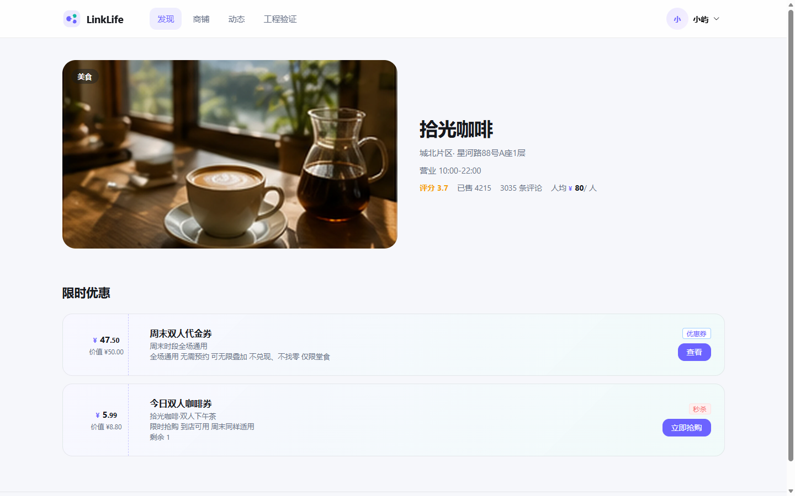
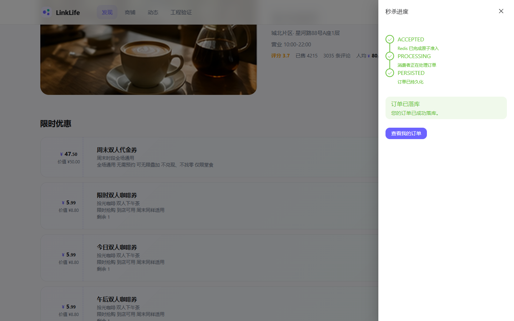
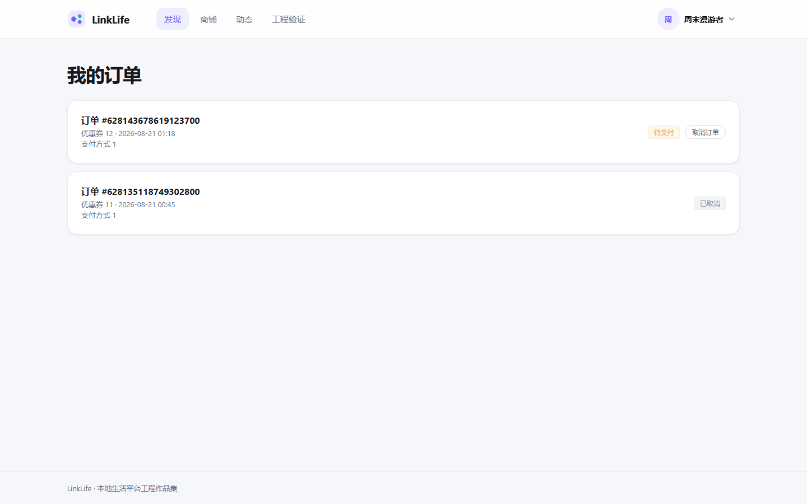
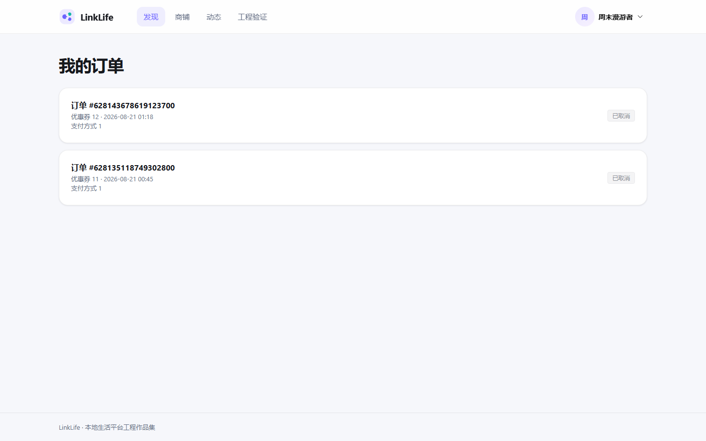
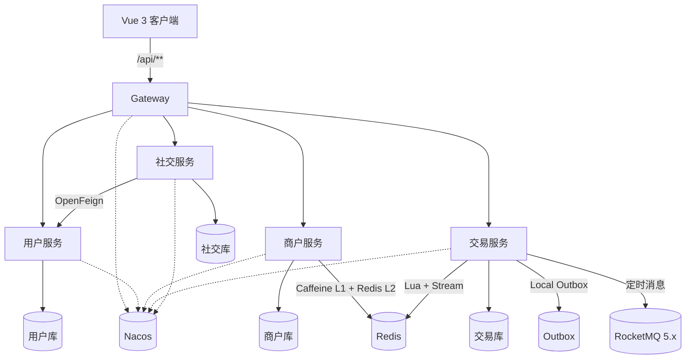

# LinkLife

> 面向高并发交易、缓存一致性与订单可靠性的本地生活微服务平台。

**项目周期：2025.09—2025.12**

**技术栈：** Java 17、Spring Boot 3.5、Spring Cloud Alibaba、Gateway、Nacos、OpenFeign、Sentinel、MySQL、Redis、Caffeine、RocketMQ 5.x、MyBatis-Plus、Docker、JMeter、Vue 3、TypeScript、Vite

LinkLife 覆盖用户会话、商铺发现、GEO 附近商铺、优惠券秒杀、异步订单、动态内容、关注与点赞等本地生活场景。项目按用户、商户、交易、社交拆分业务服务，重点实现秒杀削峰、两级缓存、未支付订单可靠关闭、服务治理与故障恢复。

[系统架构](docs/architecture.md) · [性能测试](docs/performance.md) · [可靠性验证](docs/reliability.md) · [运行指南](docs/runbook.md)

## 1. 核心亮点

| 方向 | 实现 |
|---|---|
| 秒杀削峰 | Redis Lua 原子校验库存与一人一单，Redis Stream 异步落库 |
| 异步可靠性 | Consumer Group、PEL 恢复、有界重试、DLQ 与幂等补偿 |
| 订单关单 | Local Outbox + RocketMQ 定时消息主动触发，Scheduler 定时修复 |
| 幂等控制 | `UNPAID → CANCELED` MySQL 条件更新吸收重复消息与双路径竞争 |
| 两级缓存 | Caffeine L1 + Redis L2 + 空值缓存 + 互斥回源 + epoch fence |
| 微服务治理 | Gateway Sentinel 热点限流，Social → Identity 熔断与降级 |
| 数据隔离 | 4 个业务数据库、Redis ACL 命名空间、Gateway 可信身份头 |
| 工程验证 | 1011 项自动化测试、双机压测、Redis/MySQL/RocketMQ 故障演练 |

## 2. 运行效果

### 商铺与优惠券



Vue 页面通过 Gateway 调用 Merchant 与 Transaction，展示商铺信息、优惠券和实时库存。

### 秒杀异步落库



秒杀请求完成 Redis 原子准入后进入 Stream，页面轮询提交状态，只有订单完成 MySQL 持久化后才展示“订单已落库”。

### 未支付订单自动关闭

| 待支付 | 到期自动取消 |
|---|---|
|  |  |

订单到期后由 RocketMQ 定时消息主动触发，Scheduler 提供定时修复，两条路径共用同一关闭逻辑。

## 3. 系统架构



运行时由 **4 个业务服务 + 1 个 Gateway** 组成。外部请求统一经 Gateway 进入，业务服务各自拥有独立 MySQL 数据库，并通过 Nacos 完成服务发现。

## 4. 秒杀交易链路

```text
客户端请求
  ↓
Gateway 会话认证与热点限流
  ↓
Redis Lua
  ├─ 校验并扣减库存
  ├─ 校验一人一单
  └─ 写入 Redis Stream
  ↓
Consumer Group / PEL
  ↓
MySQL 本地事务
  ├─ 扣减数据库库存
  ├─ 创建 UNPAID 订单
  └─ 冻结 payment_due_at
  ↓
ACK
```

准入成功后，前端通过提交状态查询异步处理进度：

```text
ACCEPTED → PROCESSING → PERSISTED
```

- `ACCEPTED`：Redis 已完成原子准入；
- `PROCESSING`：消费者正在处理订单；
- `PERSISTED`：订单已完成数据库持久化。

消费者结合 PEL 定时恢复、重试计数、DLQ 和补偿脚本处理异常与重复消费；数据库唯一约束继续保证一人一单。

## 5. 未支付订单可靠关闭

订单创建时在 MySQL 事务内冻结 `payment_due_at`，并将超时消息发布意图写入 Local Outbox：

```text
订单创建事务
  ├─ INSERT UNPAID 订单
  ├─ 写入 payment_due_at
  └─ INSERT 超时消息 Outbox
             ↓
       RocketMQ 定时消息
             ↓
      统一订单关闭逻辑 ← Scheduler 定时修复
             ↓
   UNPAID → CANCELED 条件更新
             ↓
   MySQL 库存返还 + Redis 幂等补偿
```

- Outbox 将订单提交与消息发布衔接起来，Broker 恢复后可继续投递；
- RocketMQ 与 Scheduler 共用同一个到期时间和关闭入口；
- MySQL 条件更新决定唯一关单结果，重复消息不会重复返还库存；
- `ORDER_CLOSED` Outbox 驱动 Redis 库存补偿，Lua 标记保证重复执行仍然幂等。

## 6. 两级缓存

```text
Caffeine L1
   ↓
Redis L2
   ↓
MySQL
```

热点商铺查询使用 Caffeine 与 Redis 两级缓存：

- 空值缓存拦截不存在数据的重复查询；
- Redis 互斥锁控制并发回源；
- 数据库事务提交后统一失效缓存；
- epoch fence 阻止写操作期间的旧查询重新回填 L1；
- GEO 索引在服务启动时从 MySQL 重建，并在商铺写事务提交后更新。

## 7. 微服务治理与数据隔离

- Gateway 统一完成会话认证、路由转发和可信用户头注入；
- Sentinel 对动态热点、商铺列表和秒杀接口执行精确限流；
- Social → Identity 通过 OpenFeign 批量查询用户摘要，并配置熔断与降级；
- 4 个业务服务分别使用独立数据库与最小权限账号；
- Redis 通过 ACL 用户和命名空间隔离各服务数据；
- 商铺与优惠券管理接口配置管理员身份校验。

## 8. 性能与可靠性验证

### 自动化测试

```text
Tests     1011
Failures  0
Errors    0
Skipped   5
```

测试覆盖缓存、秒杀、订单状态、Outbox、RocketMQ 超时关单、服务边界、权限校验和故障恢复分支。

### 双机热点查询

服务端运行 LinkLife 与 Docker 依赖，独立压测机运行 JMeter 5.6.3，两机通过 1 Gbps 有线网络连接。

| 并发 | Caffeine | 中位 QPS | P95 | P99 | Redis GET / 请求 |
|---|---:|---:|---:|---:|---:|
| 50 | 关闭 | ≈ 12.1K | 6 ms | 8 ms | ≈ 0.831 |
| 50 | 开启 | ≈ 14.3K | 5 ms | 7 ms | ≈ 0.000235 |
| 100 | 关闭 | ≈ 14.4K | 11 ms | 15 ms | ≈ 0.838 |
| 100 | 开启 | ≈ 17.0K | 9 ms | 13 ms | ≈ 0.000179 |
| 200 | 关闭 | ≈ 15.6K | 21 ms | 30 ms | ≈ 0.828 |
| 200 | 开启 | ≈ 17.2K | 17 ms | 24 ms | ≈ 0.000166 |
| 500 | 关闭 | ≈ 15.6K | 40 ms | 52 ms | ≈ 0.788 |
| 500 | 开启 | ≈ 17.4K | 36 ms | 45 ms | ≈ 0.000092 |

**500 并发热点查询下，QPS 约 17.4K、P95 为 36 ms，Redis GET 调用量降低约 99.98%。**

### 双机秒杀验证

300 / 500 / 800 / 1000 个不同用户分别执行 3 轮突发秒杀，并在每轮结束后核对 Redis 库存、已下单用户、MySQL 订单、PEL 与 DLQ。

| 指标 | 1000 用户档结果 |
|---|---:|
| 连续验证 | 3 轮 |
| 持久化订单 | 1000 |
| 不同用户 | 1000 |
| 重复订单 | 0 |
| 超卖 | 0 |
| HTTP 错误 | 0 |
| P95 | ≈ 40 ms |
| P99 | ≈ 44 ms |
| PEL / DLQ | 0 / 0 |

完整方法和逐轮结果见 [性能测试文档](docs/performance.md) 与 [双机逐轮数据](docs/evidence/two-machine-results.csv)。

### 故障演练

项目对 Gateway 过载、Identity 中断、Redis 重启、秒杀期间 MySQL 中断，以及 RocketMQ 发布、消费和重启场景进行了真实演练，验证了限流、降级、Pending 恢复、Outbox 重试和订单最终收敛。详情见 [可靠性验证](docs/reliability.md)。

## 9. 快速启动

### 环境要求

- Docker Desktop
- JDK 17
- Maven
- Node.js / npm

### 后端

```bat
cd backend
mvn -DskipTests package
cd ..
copy backend\deploy\stage4.env.example .env
```

填写 `.env` 中的本地开发配置后启动：

```bat
docker compose --env-file .env -f backend\deploy\docker-compose.stage4.yml up -d
```

Gateway 地址：`http://127.0.0.1:8080`

### 前端

```bash
cd frontend
npm ci
npm run dev
```

前端默认地址：`http://127.0.0.1:5173`

完整启动、接口演示与故障复现步骤见 [运行指南](docs/runbook.md)。

## 10. 仓库结构

```text
backend/
  linklife-common-core/          跨服务公共契约
  linklife-common-web/           MVC 公共能力
  linklife-gateway/              统一网关
  linklife-identity-service/     用户与会话
  linklife-merchant-service/     商铺、缓存与 GEO
  linklife-transaction-service/  秒杀、订单、Outbox 与 RocketMQ 超时
  linklife-social-service/       动态、关注与点赞

frontend/                        Vue 3 展示前端
performance-test/                JMeter 压测与故障演练工具
docs/                            架构、性能、可靠性与运行文档
```
