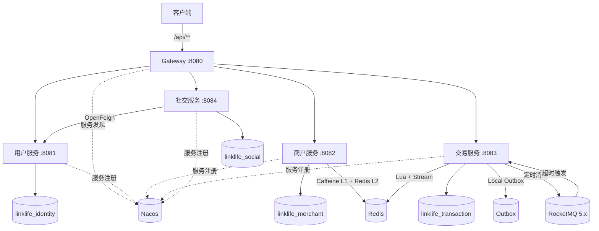

# LinkLife 系统架构

## 1. 运行拓扑



Gateway 是统一外部入口，业务服务通过 Nacos 注册与发现。MySQL 按业务服务拆分数据库，Redis 通过 ACL 用户和命名空间隔离数据。

## 2. 服务职责

| 服务 | 主要职责 |
|---|---|
| Gateway | 会话认证、内部头清洗、路由转发、Sentinel 热点限流 |
| Identity | 用户、验证码、登录会话与用户摘要批量接口 |
| Merchant | 商铺、分类、文件上传、两级缓存与 GEO 附近商铺 |
| Transaction | 优惠券、秒杀、异步订单、Outbox、超时关单与库存补偿 |
| Social | 动态、关注、点赞，以及用户摘要批量查询 |

## 3. 数据库拆分

- `linklife_identity`：用户与会话相关持久化数据；
- `linklife_merchant`：商铺、商铺分类与 GEO 数据源；
- `linklife_transaction`：优惠券、秒杀库存、订单、Outbox 与状态日志；
- `linklife_social`：动态、点赞与关注关系。

每个服务使用独立账号访问本服务数据库。建表脚本位于各模块 `src/main/resources/db/schema.sql`，升级脚本位于 `db/upgrade/`。

## 4. Redis 数据划分

| 命名空间 | 归属 |
|---|---|
| `identity:*` | 验证码、会话与签到 |
| `merchant:*` | 商铺缓存、互斥锁与 GEO |
| `transaction:*` | 秒杀库存、已下单用户、提交状态、Stream 与 DLQ |
| `social:*` | 社交模块业务键与锁 |

Redis 开启 AOF 并挂载数据卷；Gateway 只读取登录会话相关键。

## 5. 秒杀交易链路

```text
POST /api/voucher-order/seckill/{id}
  → Gateway 认证与 Sentinel 限流
  → Redis Lua：扣库存、一人一单、写入 Stream
  → submission = ACCEPTED
  → OrderStreamConsumer 消费
  → MySQL 事务落库并冻结 payment_due_at
  → submission = PERSISTED
  → ACK
```

订单业务状态与异步提交状态分别维护：MySQL 保存最终订单事实，Redis 保存秒杀准入和提交进度。

消费失败后，消费者从 PEL 恢复未确认消息，并结合重试计数、失败分类、DLQ 和幂等补偿完成收敛。

## 6. 超时关单链路

```text
payment_due_at
  ├─ Local Outbox → RocketMQ 定时消息 → PushConsumer
  └─ Scheduler 定时扫描
              ↓
    OrderCloseTransactionService
              ↓
    UNPAID → CANCELED MySQL 条件更新
              ↓
    库存返还 + 状态日志 + ORDER_CLOSED Outbox
              ↓
    Redis Lua 幂等库存补偿
```

- 订单与超时消息发布意图在同一个 MySQL 本地事务内提交；
- RocketMQ 主动触发到期订单，Scheduler 定时修复遗漏任务；
- 两条路径共用关闭入口，由 MySQL 条件更新决定唯一成功者；
- 重复消息不会重复关闭订单或重复返还库存。

## 7. 缓存链路

Merchant 的热点读路径为：

```text
Caffeine L1 → Redis L2 → MySQL
```

- Redis 空值缓存处理缓存穿透；
- 互斥锁控制并发回源，锁释放使用 owner token + Lua；
- 写事务提交后删除 Redis 缓存并失效本地缓存；
- epoch fence 阻止写操作期间的旧查询回填 L1；
- GEO 索引在服务启动时由 MySQL 重建，在商铺写事务提交后维护。

## 8. 服务治理

- Gateway Sentinel 对动态热点、分类商铺和秒杀接口执行热点限流；
- Social → Identity 使用 OpenFeign 批量获取用户摘要；
- 展示接口在 Identity 故障时返回基础内容，依赖用户真实性的接口直接返回服务不可用；
- Gateway 清洗客户端传入的身份头，再注入可信用户信息；
- 商铺和优惠券管理写接口通过管理员身份守卫校验。

## 9. 故障恢复

- Redis 重启后从 AOF 与数据卷恢复会话、Stream、Consumer Group 和 PEL；
- MySQL 中断时，已经准入的秒杀消息保留在 PEL，数据库恢复后继续落库；
- RocketMQ 发布失败时，Outbox 保留待发送记录并重试；
- Consumer 或 Broker 恢复后继续处理已持久化的定时消息；
- 缓存与 GEO 更新均在数据库事务提交后执行，避免回滚事务产生额外副作用。

完整演练结果见 [可靠性验证](reliability.md)。
