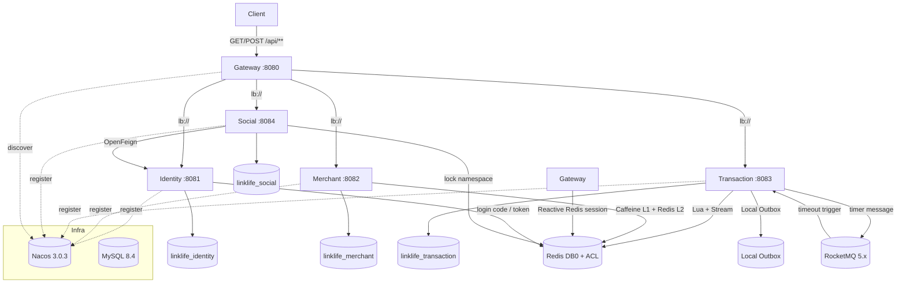

# LinkLife Architecture

本文件描述仓库中真实存在的组件与拓扑，不包含未使用的组件。

## 1. Runtime topology



业务服务仅通过 Gateway 对外暴露；基础组件 dev 端口绑定 127.0.0.1。

## 2. Service boundaries

| Service | Responsibility |
|---|---|
| Gateway | 唯一外部入口；Reactive Redis 会话认证（新 key 优先、legacy 兼容、损坏 fail-closed）；内部头清洗；路由转发；Sentinel 热点限流 |
| Identity | 用户注册/登录/验证码、会话 token、用户摘要内部批量 API |
| Merchant | 商铺/商铺类型；Caffeine L1 + Redis L2 二级缓存；Redis GEO 附近商铺索引（启动重建 + afterCommit 维护） |
| Transaction | 优惠券/秒杀/订单；Redis Lua 原子准入、Stream 异步落库、本地 Outbox、RocketMQ 超时触发、Scheduler 兜底、统一关闭内核、补偿/DLQ |
| Social | 博客/关注/点赞；MySQL 为事实源；Social→Identity 批量用户摘要 Feign（展示降级/正确性 fail-closed） |

## 3. Database ownership

- 4 个独立数据库：`linklife_identity`、`linklife_merchant`、`linklife_transaction`、`linklife_social`。
- 每服务使用最小权限账号（仅本库 SELECT/INSERT/UPDATE/DELETE）。
- 权威建表脚本位于各服务 `src/main/resources/db/schema.sql`（升级脚本在 `db/upgrade/`）。
- 无跨库引用；promotion 与 trade 同库同进程（见 §9）。

## 4. Redis ownership

- 单实例 DB0 + per-service ACL user（`identity:*`、`merchant:*`、`transaction:*`、`social:*`），跨 namespace 返回 NOPERM。
- Gateway 仅可读会话键（`identity:login:token:*`、legacy `login:token:*`）。
- AOF everysec + named volume：容器重建后恢复 session/stream/PEL 状态。
- 交易侧 key：`transaction:seckill:*`、`transaction:order:*`、`transaction:stream.orders`（+ DLQ/retry）。
- 缓存侧 key：`merchant:cache:shop:{id}`、`merchant:cache:shop-type:list`、`merchant:shop:geo:{typeId}`。

## 5. Transaction path

```text
POST /api/voucher-order/seckill/{id}
  → Gateway 会话认证 + Sentinel 限流
  → Redis Lua：扣库存 → 一人一单（SADD）→ submission=ACCEPTED → XADD stream.orders
  → OrderStreamConsumer（group g1）：
      markProcessing → MySQL 事务落库（冻结 payment_due_at）→ markPersisted → ACK
  → 失败重试 Pending → 终态分类（恢复 / 补偿 / DLQ）
```

订单状态（1-6）与提交状态机（ACCEPTED/PROCESSING/PERSISTED/FAILED）严格区分：MySQL 为最终事实源，Redis 为准入与提交状态。

## 5a. Unpaid-order timeout path

`payment_due_at` 是订单创建事务内冻结的订单级绝对到期事实，RocketMQ 主动触发与 Scheduler 修复兜底共享同一事实、同一关闭内核：

```text
payment_due_at
  ├─ Local Outbox → RocketMQ 5.x timer message → PushConsumer
  └─ Scheduler（payment_due_at 扫描，repair / sweep fallback）
              ↓
    OrderCloseTransactionService（MySQL 本地事务）
              ↓
    UNPAID → CANCELED CAS + MySQL stock +1 + 状态日志 + ORDER_CLOSED Outbox
              ↓
    Redis 幂等库存补偿（ORDER_CLOSED Outbox Handler）
```

- 订单创建与 timeout 发布意图在同一个 MySQL 本地事务提交，消除 DB/MQ 双写丢失窗口；
- RocketMQ 投递为 at-least-once，重复消息与 MQ/Scheduler 竞争由 `UNPAID → CANCELED` CAS 吸收；
- Broker 不可达时 Producer/Consumer 后台自动重试初始化，不阻断 Transaction 与 Scheduler；
- RocketMQ 只属于 Transaction 未支付超时链路，**不是跨服务 Event Bus**。

## 6. Cache path

- Merchant 读多写少接口：Caffeine L1 → Redis L2（mutex 单飞回源）→ MySQL。
- L1 miss 先记录 epoch，L2/DB 加载完成后再条件写回 L1（epoch 未变才允许）。
- 写路径 afterCommit：先删 Redis L2，finally 中最终失效本地 L1；epoch fence 拒绝并发在途陈旧回填。
- 多实例为 bounded staleness，不宣称分布式强一致。
- 附近商铺查询读取 `merchant:shop:geo:{typeId}`；索引在 fresh startup 从 MySQL 重建，并在 create/update 事务提交后维护，回滚不产生 Redis side effect。

## 7. Service governance

- Gateway Sentinel：`/api/blog/hot`、`/api/shop/of/type`、`/api/voucher-order/seckill/**` 三类热点精确 QPS 限流，429 JSON。
- Social→Identity：exception-ratio 熔断；展示型 RPC 降级为空 map（不伪造用户）；正确性型 RPC fail-closed。
- 管理写接口（商铺/秒杀券）由 admin 身份守卫拦截。

## 8. Failure boundaries

- 事务提交后才执行缓存失效与 GEO 维护：回滚不产生 Redis side effect。
- Redis 写失败仅记录错误，不伪装 DB 回滚；启动重建是 GEO/缓存的恢复机制。
- Stream Pending 定时恢复 + 重试计数 + 终态分类 + DLQ 去重，保证“已投递未确认”消息最终一致。
- MySQL 不可用时已准入订单保持 Pending，恢复后同一 orderId 落库。

## 9. Why promotion + trade remain together

优惠券创建与订单落库共享 `linklife_transaction` 库与同一进程事务（Outbox、补偿、超时关闭都在同一事务边界内）。拆分会引入跨服务/跨库事务或分布式事务中间件；当前量级用本地事务 + Outbox + Stream 更简单可靠。

## 10. Explicit non-goals

- 不使用 Kafka / Seata / Kubernetes / Prometheus / Grafana / SkyWalking。
- RocketMQ 仅以 5.x 单节点开发/集成拓扑出现在 Transaction 超时链路，不是生产集群 HA，也不是跨服务总线。
- 未做 Nacos 集群、MySQL 主从、Redis Cluster/Sentinel、网络分区演练。
- 当前公开性能数字来自双机本地工程验证：服务端与 JMeter 压测端分离，通过 1 Gbps 有线网络直连；结果用于工程对比与正确性验证，不外推为生产 SLA 或容量。
- 早期同机 Docker/JMeter 数据仅作为历史 baseline 保留，详见 docs/performance.md。
